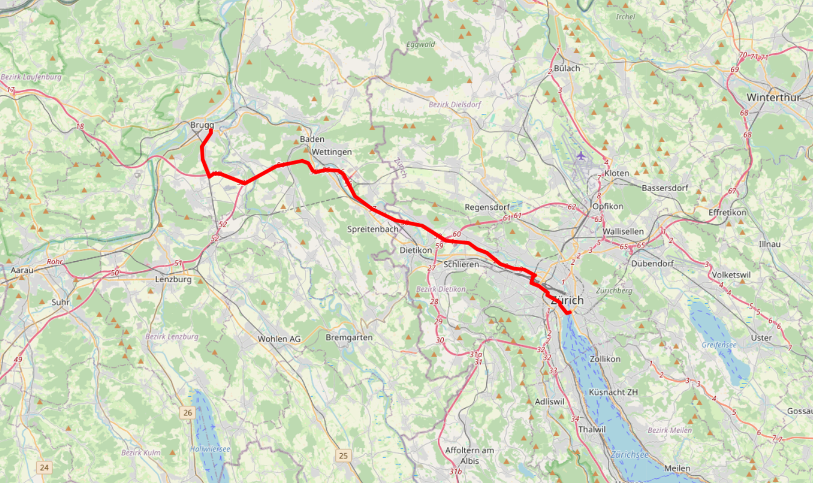
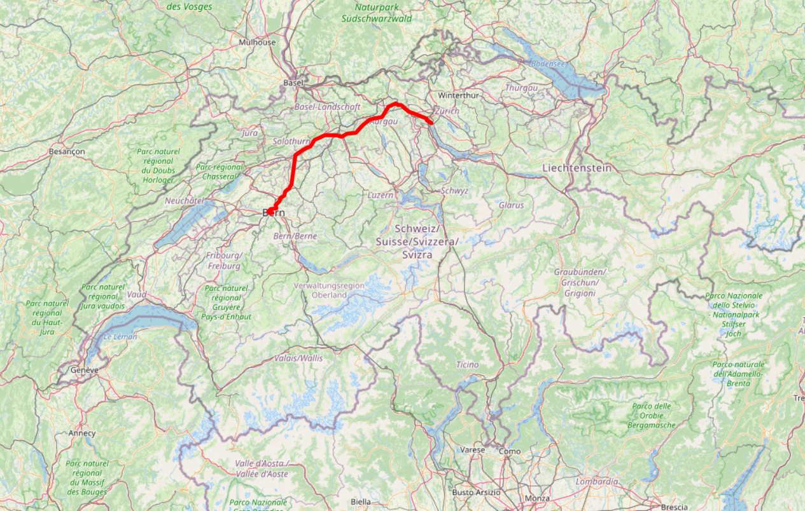
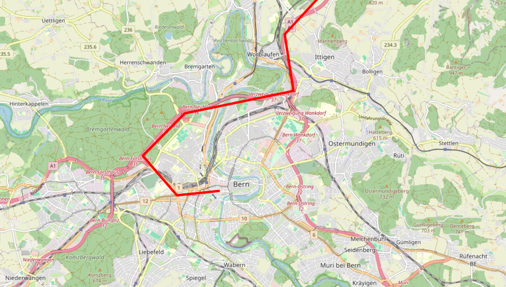

# cartons

A lightweight Python toolkit for **routing and map visualization**.

`cartons` calculates routes using **OSRM (Open Source Routing Machine)** and renders them on interactive maps using **Folium**. With only a few lines of Python, you can compute a route between two coordinates and generate an HTML map displaying the route.



---

## Features

- Simple routing between geographic coordinates
- Interactive map visualization
- Lightweight and easy to integrate into scripts
- Minimal code required
- Built on top of OSRM and Folium

---

## Installation

Install via pip:

```bash
pip install cartons
```

---

## Quick Example

```python
import cartons
#if you want to see the map for fun, open it using the Webbrowser module
import webbrowser

# Bern → Zürich
m = cartons.draw(
    "https://router.project-osrm.org",
    7.4442153, 46.94686,
    8.5431302, 47.3668725,
    "red",5
)

filename = "route.html"

m.save(filename)
webbrowser.open(filename)
```

This generates an interactive HTML map showing the route.



---

## How It Works

cartons connects to an **OSRM routing server** to calculate routes and renders them using **Folium**.

```
Coordinates
    ↓
cartons routing
    ↓
OSRM route calculation
    ↓
route geometry
    ↓
Folium map rendering
    ↓
Interactive HTML map
```

---

## API

### draw()

Creates a route and returns a Folium map.

```python
draw(base_url, lon1, lat1, lon2, lat2, color="blue", weight=5)
```

| Parameter | Description |
|----------|-------------|
| base_url | OSRM routing server URL |
| lon1 | Longitude of starting point |
| lat1 | Latitude of starting point |
| lon2 | Longitude of destination |
| lat2 | Latitude of destination |
| color | Route line color |
| weight | Route line thickness |

Returns:

```
folium.Map
```

You can then save or modify the map using Folium.

Example:

```python
map = cartons.draw(...)
map.save("route.html")
```

---

## Example Output

The generated map is a fully interactive **Leaflet map**.

Features include:

- Zoom and pan
- Inspect the route visually
- Export as an HTML file
- Embed into web pages



---

## Use Cases

cartons can be useful for:

- route visualization
- travel route maps
- logistics planning
- GPS data analysis
- small mapping tools
- data science experiments

---

## Development

Clone the repository:

```bash
git clone https://github.com/AndPan3/cartons.git
cd cartons
```

Install in development mode:

```bash
pip install -e .
```

---

## Contributing

Contributions are welcome.

If you find a bug or have ideas for improvements:

1. Open an issue
2. Submit a pull request

---

## License

MIT License

---

## Author

**AndPan3**

---

## Acknowledgements

This project uses:

- OSRM for routing
- Folium for map visualization
- Leaflet.js for interactive maps