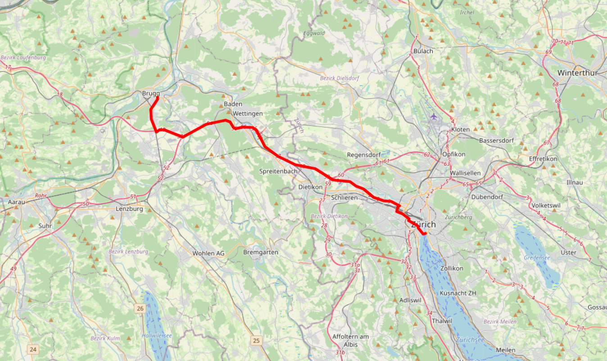
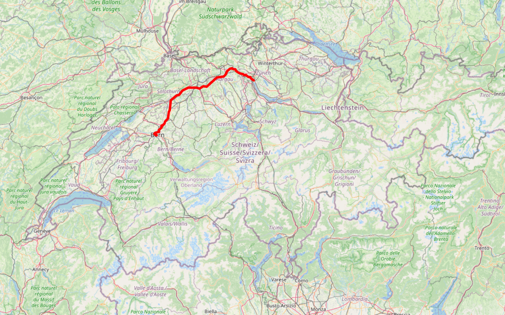
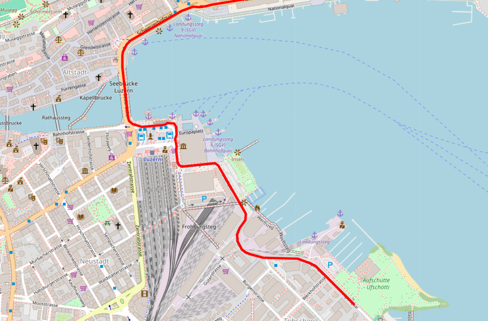

# Cartons

[](https://pypi.org/project/cartons/)
[](https://pypi.org/project/cartons/)
[](https://github.com/AndPan3/Cartons/blob/main/LICENSE)
[](https://pypi.org/project/cartons/)
[](https://github.com/AndPan3/Cartons/stargazers)
[](https://github.com/AndPan3/Cartons/network/members)
[](https://github.com/AndPan3/Cartons/issues)
[](https://github.com/AndPan3/Cartons/pulls)
[](https://github.com/AndPan3/Cartons/commits/main/)
[](https://github.com/AndPan3/Cartons)
[](https://github.com/AndPan3/Cartons)
[](https://github.com/AndPan3/Cartons)
[](https://github.com/AndPan3/Cartons)
[](#)

> A lightweight Python toolkit for OSRM routing, route geometry conversion, and interactive Folium map visualization.

[](https://pypi.org/project/cartons/)
[](https://pypi.org/project/cartons/)
[](otherfiles/LICENSE)
[](https://github.com/AndPan3/cartons)

Cartons gives you a small Python API for sending coordinate sequences to an [OSRM](https://project-osrm.org/) routing server through [routingpy](https://routingpy.readthedocs.io/), inspecting the returned route, converting route geometry into [Shapely](https://shapely.readthedocs.io/) / GeoJSON forms, and rendering interactive maps with [Folium](https://python-visualization.github.io/folium/).

The project deliberately stays small: it is not a complete GIS framework, geocoder, routing server, or navigation application. It focuses on the path from **coordinates → route → geometry → interactive map**.

> [!IMPORTANT]
> **This README is the official documentation for Cartons 1.3.0.** All installation instructions, signatures, examples, coordinate conventions, and API behavior below document the **1.3.0 API**. Routing functions use coordinate sequences such as `[[lon, lat], [lon, lat]]`.

---

## Preview

### Geneva → Zürich

A long-distance route rendered across Switzerland.



### Bern → Zürich

A shorter intercity route.



### Zoomed route detail

A close-up view of route geometry on the interactive map.



---

## Table of contents

- [What Cartons does](#what-cartons-does)
- [What's new in 1.3.0](#whats-new-in-130)
- [Requirements](#requirements)
- [Installation](#installation)
- [Quick start](#quick-start)
- [Coordinate order](#coordinate-order)
- [How Cartons works](#how-cartons-works)
- [Public API](#public-api)
  - [`route()`](#route)
  - [`draw()`](#draw)
  - [`simpleroute()`](#simpleroute)
  - [`simpledraw()`](#simpledraw)
  - [`line_string_route()`](#line_string_route)
  - [`geo_json_geometry()`](#geo_json_geometry)
- [Examples](#examples)
- [OSRM servers and transport profiles](#osrm-servers-and-transport-profiles)
- [Map tiles and attribution](#map-tiles-and-attribution)
- [Return types and data model](#return-types-and-data-model)
- [Error handling](#error-handling)
- [Performance and network behavior](#performance-and-network-behavior)
- [Privacy considerations](#privacy-considerations)
- [Project structure](#project-structure)
- [Development](#development)
- [Testing status](#testing-status)
- [Release and PyPI publishing](#release-and-pypi-publishing)
- [Migrating from 1.2.x to 1.3.0](#migrating-from-12x-to-130)
- [Known limitations](#known-limitations)
- [Roadmap](#roadmap)
- [Troubleshooting](#troubleshooting)
- [Contributing](#contributing)
- [License](#license)
- [Acknowledgements](#acknowledgements)

---

## What Cartons does

Cartons currently provides six root-level public functions:

| Function | Purpose | Network request? | Main return type |
|---|---|---:|---|
| `cartons.route()` | Calculate an OSRM route | Yes | routingpy route/direction object |
| `cartons.draw()` | Calculate and draw a configurable route | Yes | `folium.Map` |
| `cartons.simpleroute()` | Calculate and draw a route with fixed styling | Yes | `folium.Map` |
| `cartons.simpledraw()` | Draw an already-existing coordinate path | No OSRM request | `folium.Map` |
| `cartons.line_string_route()` | Calculate a route and convert its geometry to Shapely | Yes | `shapely.LineString` |
| `cartons.geo_json_geometry()` | Calculate a route and export its geometry as GeoJSON text | Yes | `str` |

The public names above are exported by `cartons/__init__.py`, so normal usage is simply:

```python
import cartons
```

### Features

- OSRM route requests through `routingpy.OSRM`
- Full route overview geometry (`overview="full"`)
- Multiple input coordinates accepted as a coordinate sequence
- Access to route metadata such as distance, duration, and geometry from the routingpy result
- Interactive Folium map output
- Automatic map fitting around the route
- Optional start/end route markers in `draw()`
- Custom route color, line weight, tile source, and tile attribution in `draw()`
- Fast local drawing of precomputed `[lat, lon]` coordinate paths with `simpledraw()`
- Shapely `LineString` conversion
- GeoJSON geometry serialization
- Pure-Python package interface and OS-independent packaging metadata

### What it does not provide

Cartons currently does **not** provide geocoding, its own routing engine, offline map tiles, turn-by-turn navigation UI, traffic data, route-alternative controls, built-in retries, caching, or a web server. Those responsibilities belong to the configured OSRM/tile services or to your application.

---

## What's new in 1.3.0

Cartons 1.3.0 standardizes routing around an ordered coordinate-list API and expands geometry output options.

### Coordinate-list routing API

Route-calculating functions use an ordered list of `[longitude, latitude]` pairs:

```python
coords = [
    [7.4442153, 46.94686],
    [8.5431302, 47.3668725],
]

route = cartons.route(
    "https://router.project-osrm.org",
    coords,
    "driving",
)
```

This format supports two-point routes as well as routes containing additional ordered waypoints.

### Geometry conversion helpers

Cartons 1.3.0 exposes:

```python
cartons.line_string_route(...)
cartons.geo_json_geometry(...)
```

These helpers convert routed OSRM geometry into a Shapely `LineString` or GeoJSON geometry text.

### Python requirement

Cartons 1.3.0 requires **Python 3.10 or newer**.

### Documentation

This README is the primary user and developer documentation for the 1.3.0 release and documents the code shipped by this version.


---

## Requirements

Cartons 1.3.0 requires:

- **Python 3.10+**
- `routingpy`
- `folium`
- `shapely`
- access to an OSRM-compatible routing server for functions that calculate routes

The dependencies are currently unpinned in `pyproject.toml`, so a normal install resolves the latest compatible versions available to your Python environment.

---

## Installation

### Install Cartons 1.3.0 from PyPI

```bash
python -m pip install cartons
```

To explicitly install this release:

```bash
python -m pip install "cartons==1.3.0"
```

### Install from GitHub

```bash
python -m pip install "git+https://github.com/AndPan3/cartons.git"
```

Use this when you intentionally want the repository version rather than the packaged PyPI release.

### Development install

```bash
git clone https://github.com/AndPan3/cartons.git
cd cartons
python -m pip install -e .
```

### Check the installed version

Cartons 1.3.0 does not define `cartons.__version__`. Use Python package metadata:

```python
from importlib.metadata import version

print(version("cartons"))
```

---

## Quick start

The 1.3.0 routing API accepts coordinates as a list of `[longitude, latitude]` pairs.

```python
import cartons

BASE_URL = "https://router.project-osrm.org"

# Bern -> Zürich
coords = [
    [7.4442153, 46.94686],
    [8.5431302, 47.3668725],
]

route = cartons.route(
    BASE_URL,
    coords,
    "driving",
)

print(f"Distance: {route.distance / 1000:.2f} km")
print(f"Duration: {route.duration / 60:.1f} min")
print(f"Geometry points: {len(route.geometry)}")
```

To calculate and display the same route on a Folium map:

```python
import cartons

BASE_URL = "https://router.project-osrm.org"
coords = [
    [7.4442153, 46.94686],
    [8.5431302, 47.3668725],
]

m = cartons.draw(
    BASE_URL,
    coords,
    col="red",
    weight=5,
    tiles="CartoDB Positron",
    attribution="© OpenStreetMap contributors © CARTO",
    transport="driving",
    marker=True,
)

m.save("route.html")
```

Open `route.html` in a browser, or display `m` directly in a notebook environment that renders Folium maps.

---

## Coordinate order

This is the most important convention in the package.

### Routing functions: `[longitude, latitude]`

The following functions eventually pass `coords` directly to `routingpy.OSRM.directions()` and therefore expect routing coordinates in `[lon, lat]` order:

```python
coords = [
    [7.4442153, 46.94686],   # Bern: [lon, lat]
    [8.5431302, 47.3668725], # Zürich: [lon, lat]
]
```

Use `[lon, lat]` with:

- `route()`
- `draw()`
- `simpleroute()`
- `line_string_route()`
- `geo_json_geometry()`

### `simpledraw()`: `[latitude, longitude]`

Folium uses `[lat, lon]` coordinates. Because `simpledraw()` does **not** call OSRM and does not swap coordinate order, you provide display-ready coordinates directly:

```python
coords_for_folium = [
    [46.94686, 7.4442153],   # Bern: [lat, lon]
    [47.3668725, 8.5431302], # Zürich: [lat, lon]
]

m = cartons.simpledraw(coords_for_folium)
```

### Why the order differs

OSRM/routingpy geometry is represented as longitude/latitude pairs, while Folium/Leaflet location arrays are latitude/longitude. `draw()` and `simpleroute()` convert route geometry internally:

```text
OSRM geometry     [lon, lat]
        |
        | internal swap
        v
Folium geometry   [lat, lon]
```

`simpledraw()` skips routing entirely, so the caller supplies the Folium form.

---

## How Cartons works

```text
[lon, lat] coordinate list
          |
          v
  cartons.route()
          |
          v
 routingpy.OSRM
          |
          v
   OSRM server
          |
          v
routingpy route object
   |       |       |
   |       |       +--> distance / duration / metadata
   |       |
   |       +----------> route.geometry ([lon, lat])
   |
   +------------------> cartons.draw() / cartons.simpleroute()
                         |
                         +--> swap to [lat, lon]
                         +--> Folium PolyLine
                         +--> fit_bounds()
                         +--> folium.Map

route.geometry
   |
   +--> cartons.line_string_route() --> Shapely LineString
   |
   +--> cartons.geo_json_geometry() --> GeoJSON geometry string
```

Every route-calculating helper creates an `OSRM` client from the supplied `base_url` and makes a route request. `simpledraw()` is the exception: it only creates a Folium map from coordinates you already have.

---

# Public API

## `route()`

Calculate a route with OSRM and return the routingpy result object.

```python
cartons.route(base_url, coords, transport)
```

### Signature

```python
def route(base_url, coords: list, transport):
    ...
```

### Parameters

| Parameter | Type | Required | Description |
|---|---|---:|---|
| `base_url` | `str` | Yes | Base URL of the OSRM server. |
| `coords` | `list` | Yes | Ordered route locations, normally `[[lon, lat], ...]`. |
| `transport` | `str` | Yes | Profile forwarded to `routingpy.OSRM.directions()`. Profile behavior depends on the OSRM server. |

### Internal request

Cartons 1.3.0 calls:

```python
router.directions(
    overview="full",
    profile=transport,
    locations=coords,
)
```

This means Cartons explicitly requests the full route overview geometry but does not currently expose options such as `alternatives`, `steps`, `annotations`, `radiuses`, or `bearings`.

### Returns

A routingpy route/direction object. Commonly useful attributes include:

```python
result.geometry
result.distance
result.duration
```

`geometry` is used by the rest of Cartons and is expected to contain `[lon, lat]` coordinate pairs.

### Example

```python
import cartons

coords = [
    [6.143158, 46.204391],  # Geneva
    [8.541694, 47.376887],  # Zürich
]

result = cartons.route(
    "https://router.project-osrm.org",
    coords,
    "driving",
)

print(result.distance)
print(result.duration)
print(result.geometry[:3])
```

### Multiple waypoints

Cartons 1.3.0 forwards the entire coordinate list to routingpy, so you can provide more than two locations when supported by the backend:

```python
coords = [
    [6.143158, 46.204391],   # Geneva
    [7.447447, 46.948271],   # Bern
    [8.541694, 47.376887],   # Zürich
]

result = cartons.route(
    "https://router.project-osrm.org",
    coords,
    "driving",
)
```

The order of coordinates is the visit order; Cartons does not optimize waypoint order.

---

## `draw()`

Calculate a route and immediately draw it on a configurable Folium map.

```python
cartons.draw(
    base_url,
    coords,
    col,
    weight,
    tiles,
    attribution,
    transport,
    marker=True,
)
```

### Signature

```python
def draw(
    base_url,
    coords: list,
    col: str,
    weight: str,
    tiles: str,
    attribution: str,
    transport: str,
    marker=True,
):
    ...
```

The source annotates `weight` as `str`, but Folium line weight is conventionally supplied as a number; examples in this README use an integer.

### Parameters

| Parameter | Type | Required | Description |
|---|---|---:|---|
| `base_url` | `str` | Yes | OSRM server base URL. |
| `coords` | `list` | Yes | Route locations in `[lon, lat]` order. |
| `col` | `str` | Yes | Folium/Leaflet route line color. |
| `weight` | number/string | Yes | Route line thickness passed to `folium.PolyLine`. |
| `tiles` | `str` | Yes | Folium tile provider name or tile URL. |
| `attribution` | `str` | Yes | Attribution for the configured tile source. |
| `transport` | `str` | Yes | OSRM/routingpy profile string. |
| `marker` | `bool` | No | Add markers at the first and last points of the returned route geometry. Defaults to `True`. |

### What it does

1. Calls `route(base_url, coords, transport)`.
2. Reads `getroute.geometry`.
3. Converts every `[lon, lat]` point to `[lat, lon]` for Folium.
4. Creates a `folium.Map` with the requested tiles and attribution.
5. If `marker == True`, adds markers to the first and last **routed geometry** points.
6. Adds a `folium.PolyLine`.
7. Calls `fit_bounds()` so the map frames the route.
8. Returns the `folium.Map`.

> [!NOTE]
> The markers are attached to the first and last points of the route geometry returned by OSRM. Those points may be snapped to the road network and therefore may differ slightly from the raw coordinates you supplied.

### Example

```python
import cartons

coords = [
    [6.143158, 46.204391],
    [8.541694, 47.376887],
]

m = cartons.draw(
    "https://router.project-osrm.org",
    coords,
    col="red",
    weight=6,
    tiles="CartoDB Positron",
    attribution="© OpenStreetMap contributors © CARTO",
    transport="driving",
    marker=True,
)

m.save("geneva-zurich.html")
```

### Disable markers

```python
m = cartons.draw(
    "https://router.project-osrm.org",
    coords,
    col="blue",
    weight=5,
    tiles="CartoDB Positron",
    attribution="© OpenStreetMap contributors © CARTO",
    transport="driving",
    marker=False,
)
```

### Custom tile URL

```python
m = cartons.draw(
    "https://router.project-osrm.org",
    coords,
    col="red",
    weight=5,
    tiles="https://tiles.openfreemap.org/styles/liberty/{z}/{x}/{y}.png",
    attribution="OpenFreeMap / OpenStreetMap contributors",
    transport="driving",
)
```

When using a custom provider, use the attribution wording required by that provider and its underlying data sources.

---

## `simpleroute()`

Calculate and display a route with minimal arguments and fixed map styling.

```python
cartons.simpleroute(base_url, coords, transport)
```

### Signature

```python
def simpleroute(base_url, coords: list, transport: str):
    ...
```

### Parameters

| Parameter | Type | Required | Description |
|---|---|---:|---|
| `base_url` | `str` | Yes | OSRM server base URL. |
| `coords` | `list` | Yes | Ordered `[lon, lat]` route coordinates. |
| `transport` | `str` | Yes | OSRM/routingpy profile string. |

### Fixed styling

Cartons 1.3.0 uses:

- tiles: `CartoDB Positron`
- attribution: `Copyright: CartoDB Positron`
- route color: `red`
- line weight: `5`
- `control_scale=True`
- no start/end markers
- automatic `fit_bounds()`

### Returns

A `folium.Map`.

### Example

```python
import cartons

coords = [
    [7.4442153, 46.94686],
    [8.5431302, 47.3668725],
]

m = cartons.simpleroute(
    "https://router.project-osrm.org",
    coords,
    "driving",
)

m.save("simple-route.html")
```

Use `simpleroute()` when you want routing + visualization with almost no styling decisions. Use `draw()` when you need control over the line, tiles, attribution, or markers.

---

## `simpledraw()`

Draw an existing path without requesting a route from OSRM.

```python
cartons.simpledraw(
    coords,
    col="blue",
    weight=5,
    tiles="CartoDB Positron",
    attribution="© CartoDB Positron",
)
```

### Signature

```python
def simpledraw(
    coords: list,
    col="blue",
    weight=5,
    tiles="CartoDB Positron",
    attribution="© CartoDB Positron",
):
    ...
```

### Parameters

| Parameter | Type | Required | Default | Description |
|---|---|---:|---|---|
| `coords` | `list` | Yes | — | Display coordinates in **`[lat, lon]`** order. |
| `col` | `str` | No | `"blue"` | Polyline color. |
| `weight` | number | No | `5` | Polyline thickness. |
| `tiles` | `str` | No | `"CartoDB Positron"` | Folium tile source. |
| `attribution` | `str` | No | `"© CartoDB Positron"` | Tile attribution text. |

### Behavior

`simpledraw()`:

- does not import or call an OSRM server during the function call
- creates a Folium map
- draws your supplied coordinates as a polyline exactly in the order provided
- fits the map bounds around those points
- does not add endpoint markers

### Example

```python
import cartons

coords = [
    [46.94686, 7.4442153],
    [47.0, 7.7],
    [47.15, 8.0],
    [47.3668725, 8.5431302],
]

m = cartons.simpledraw(
    coords,
    col="red",
    weight=5,
)

m.save("custom-path.html")
```

### Good use cases

- visualizing cached route geometry
- drawing GPS tracks you have already converted to `[lat, lon]`
- drawing custom paths that are not road routes
- avoiding another OSRM request when geometry is already available

---

## `line_string_route()`

Calculate a route and convert its OSRM geometry to a Shapely `LineString`.

```python
cartons.line_string_route(coords, transport, base_url)
```

> [!CAUTION]
> The argument order differs from `route()`: `coords` and `transport` come before `base_url`.

### Signature

```python
def line_string_route(coords: list, transport: str, base_url: str):
    ...
```

### Parameters

| Parameter | Type | Required | Description |
|---|---|---:|---|
| `coords` | `list` | Yes | Route locations in `[lon, lat]` order. |
| `transport` | `str` | Yes | OSRM/routingpy profile. |
| `base_url` | `str` | Yes | OSRM server base URL. |

### Returns

A `shapely.LineString` created from the route geometry.

### Example

```python
import cartons

coords = [
    [7.4442153, 46.94686],
    [8.5431302, 47.3668725],
]

line = cartons.line_string_route(
    coords,
    "driving",
    "https://router.project-osrm.org",
)

print(line.geom_type)  # LineString
print(line.bounds)
print(line.wkt[:120])
```

### Geographic distance warning

The `LineString` contains longitude/latitude coordinates. Shapely operates in Cartesian coordinate space and does not automatically know that these are geographic degrees. Do **not** interpret `line.length` as road distance in meters or kilometers. Use the original routing result's `distance` when you need OSRM route distance, or project geometry into a suitable coordinate reference system before metric geometric calculations.

---

## `geo_json_geometry()`

Calculate a route and serialize its geometry as GeoJSON text through Shapely.

```python
cartons.geo_json_geometry(coords, transport, base_url)
```

> [!CAUTION]
> Like `line_string_route()`, this function uses the argument order `(coords, transport, base_url)`.

### Signature

```python
def geo_json_geometry(coords: list, transport: str, base_url: str):
    ...
```

### Parameters

| Parameter | Type | Required | Description |
|---|---|---:|---|
| `coords` | `list` | Yes | Route locations in `[lon, lat]` order. |
| `transport` | `str` | Yes | OSRM/routingpy profile. |
| `base_url` | `str` | Yes | OSRM server base URL. |

### Returns

A **string** containing GeoJSON for the route **geometry**. It is not a complete GeoJSON `Feature` or `FeatureCollection` and does not include route properties such as distance or duration.

Typical shape:

```json
{
  "type": "LineString",
  "coordinates": [
    [7.44, 46.94],
    [7.45, 46.95]
  ]
}
```

### Example

```python
import json
import cartons

coords = [
    [7.4442153, 46.94686],
    [8.5431302, 47.3668725],
]

geojson_text = cartons.geo_json_geometry(
    coords,
    "driving",
    "https://router.project-osrm.org",
)

print(geojson_text)

# Parse the JSON text if you need a Python dictionary.
geojson = json.loads(geojson_text)
print(geojson["type"])
```

### Create a full GeoJSON Feature

Cartons currently returns geometry only. You can wrap it yourself:

```python
import json
import cartons

coords = [
    [7.4442153, 46.94686],
    [8.5431302, 47.3668725],
]

result = cartons.route(
    "https://router.project-osrm.org",
    coords,
    "driving",
)

geometry = json.loads(
    cartons.geo_json_geometry(
        coords,
        "driving",
        "https://router.project-osrm.org",
    )
)

feature = {
    "type": "Feature",
    "geometry": geometry,
    "properties": {
        "distance_m": result.distance,
        "duration_s": result.duration,
    },
}

print(json.dumps(feature, indent=2))
```

The example above performs two routing requests because `route()` and `geo_json_geometry()` each route independently. If request efficiency matters, use `route()` once and convert `result.geometry` yourself with Shapely.

---

## Examples

### Calculate a route and inspect metadata

```python
import cartons

coords = [
    [6.143158, 46.204391],
    [8.541694, 47.376887],
]

r = cartons.route(
    "https://router.project-osrm.org",
    coords,
    "driving",
)

print(f"Distance: {r.distance / 1000:.2f} km")
print(f"Duration: {r.duration / 3600:.2f} h")
print(f"Geometry points: {len(r.geometry)}")
```

### Create a browser-ready HTML map

```python
import webbrowser
import cartons

coords = [
    [6.143158, 46.204391],
    [8.541694, 47.376887],
]

m = cartons.draw(
    "https://router.project-osrm.org",
    coords,
    col="red",
    weight=5,
    tiles="CartoDB Positron",
    attribution="© OpenStreetMap contributors © CARTO",
    transport="driving",
)

filename = "route.html"
m.save(filename)
webbrowser.open(filename)
```

### Route through an intermediate waypoint

```python
import cartons

coords = [
    [6.143158, 46.204391],   # Geneva
    [7.447447, 46.948271],   # Bern
    [8.541694, 47.376887],   # Zürich
]

m = cartons.simpleroute(
    "https://router.project-osrm.org",
    coords,
    "driving",
)

m.save("geneva-bern-zurich.html")
```

### Draw OSRM geometry without routing a second time

If you already called `route()`, convert its geometry once and use `simpledraw()`:

```python
import cartons

coords = [
    [7.4442153, 46.94686],
    [8.5431302, 47.3668725],
]

r = cartons.route(
    "https://router.project-osrm.org",
    coords,
    "driving",
)

# routingpy/OSRM geometry: [lon, lat]
# Folium/simpledraw geometry: [lat, lon]
folium_coords = [[lat, lon] for lon, lat in r.geometry]

m = cartons.simpledraw(folium_coords, col="red", weight=5)
m.save("cached-route.html")
```

### Build a Shapely object without a second network request

```python
from shapely import LineString
import cartons

coords = [
    [7.4442153, 46.94686],
    [8.5431302, 47.3668725],
]

r = cartons.route(
    "https://router.project-osrm.org",
    coords,
    "driving",
)

line = LineString(r.geometry)
print(line)
```

This pattern is more efficient than calling `route()` and `line_string_route()` separately when you need both route metadata and a Shapely geometry.

---

## OSRM servers and transport profiles

Cartons does not ship an OSRM server. You provide a `base_url` for one.

For simple experiments, the examples use:

```text
https://router.project-osrm.org
```

For production applications, consider operating your own OSRM instance or using a routing provider appropriate to your traffic volume, availability, data region, and terms of service.

### Transport/profile behavior

Cartons passes your `transport` value to routingpy's OSRM adapter as `profile=transport`.

```python
cartons.route(base_url, coords, "driving")
```

Profile support depends on the server. OSRM itself can be built with different routing profiles, and some deployments encode a routing mode in the server/base URL or otherwise ignore a client-supplied profile value. Do not assume that every OSRM endpoint supports every mode string.

If routing fails for one profile:

1. check the documentation for the OSRM endpoint you are using;
2. verify the expected profile string;
3. verify whether the deployment uses separate base URLs for car, bicycle, or foot routing.

---

## Map tiles and attribution

`draw()` and `simpledraw()` let you select a Folium tile source. `simpleroute()` uses CartoDB Positron internally.

### Named provider

```python
tiles="CartoDB Positron"
```

### Custom tile URL

```python
tiles="https://example.com/tiles/{z}/{x}/{y}.png"
```

When using a custom tile server, you are responsible for:

- using a valid Leaflet/Folium tile URL template;
- supplying any required access token or query parameters;
- following the provider's usage limits and terms;
- displaying the required attribution.

A saved Folium HTML file can still need network access when opened because the browser loads map tiles from the configured provider.

---

## Return types and data model

### routingpy result

`route()` returns routingpy's direction/route result rather than converting it into a Cartons-specific class. This keeps the wrapper small and lets callers use the upstream result directly.

Common fields used by Cartons/examples:

| Attribute | Meaning |
|---|---|
| `geometry` | Route path coordinates, used by all conversion/drawing helpers. |
| `distance` | Route distance from the routing backend, typically in meters for OSRM/routingpy. |
| `duration` | Route duration from the routing backend, typically in seconds for OSRM/routingpy. |

Additional fields depend on routingpy and the backend response.

### `folium.Map`

`draw()`, `simpleroute()`, and `simpledraw()` return normal Folium map objects. You can continue customizing them with Folium after Cartons returns them:

```python
m = cartons.simpledraw(coords)
# Add any other Folium layers, controls, markers, etc. here.
m.save("map.html")
```

### Shapely `LineString`

`line_string_route()` returns a standard Shapely geometry and can therefore be used with Shapely operations. Remember that its coordinates remain geographic longitude/latitude unless you transform them yourself.

### GeoJSON string

`geo_json_geometry()` returns serialized JSON text. Parse it with `json.loads()` when you need a Python dictionary.

---

## Error handling

Cartons currently contains very little validation or exception handling. Errors are allowed to propagate from routingpy, the HTTP stack, Folium, Shapely, or Python itself.

Typical failure causes include:

- unreachable OSRM server
- invalid base URL
- unsupported transport/profile
- malformed coordinate list
- reversed latitude/longitude
- coordinates outside the routing server's loaded dataset
- no routable road near a waypoint
- tile-provider configuration problems
- invalid geometry or incompatible dependency versions

For an application, wrap network calls with your own error handling:

```python
import cartons

try:
    r = cartons.route(
        "https://router.project-osrm.org",
        [[7.4442153, 46.94686], [8.5431302, 47.3668725]],
        "driving",
    )
except Exception as exc:
    print(f"Routing failed: {exc}")
```

For production code, prefer catching specific upstream exception types once you have chosen the routingpy/HTTP versions used by your project.

---

## Performance and network behavior

Cartons is small, but understanding where work happens helps avoid unnecessary requests.

### Functions that call OSRM

Each call to one of these functions creates an OSRM client and performs routing:

- `route()`
- `draw()`
- `simpleroute()`
- `line_string_route()`
- `geo_json_geometry()`

There is currently no built-in route cache or shared persistent client in Cartons.

### Function that does not call OSRM

`simpledraw()` only constructs a Folium map from the coordinates supplied to it. It is the correct choice when route geometry is already available.

### Avoid duplicate route requests

If you need several representations of the same route, call `route()` once and derive the rest locally:

```python
import json
from shapely import LineString, to_geojson
import cartons

r = cartons.route(base_url, coords, "driving")
line = LineString(r.geometry)
geojson_text = to_geojson(line)
folium_coords = [[lat, lon] for lon, lat in r.geometry]
m = cartons.simpledraw(folium_coords)
```

This produces route metadata, a Shapely line, GeoJSON geometry, and a Folium map from one routing request.

---

## Privacy considerations

Coordinates passed to routing functions are sent to the OSRM service identified by `base_url`. If route locations are sensitive, choose a routing service whose privacy and retention policies fit your application, or host OSRM yourself.

Interactive maps can also make browser requests to the configured tile provider when the HTML map is viewed. The tile provider can therefore receive information such as requested tile areas and normal web-request metadata.

---

## Project structure

Current repository layout:

```text
cartons/
├── .github/
│   └── workflows/
│       └── python-publish.yml
├── cartons/
│   ├── __init__.py
│   ├── display.py
│   ├── formats.py
│   ├── routing.py
│   └── simpleroute.py
├── img/
│   ├── img1.png
│   ├── img2.png
│   └── img3.png
├── otherfiles/
│   ├── Testing/
│   │   └── test1.py
│   ├── LICENSE
│   └── next.txt
├── pyproject.toml
└── README.md
```

### `cartons/__init__.py`

Defines the root public API by exporting:

```python
route

draw
simpledraw
simpleroute
line_string_route
geo_json_geometry
```

### `cartons/routing.py`

The routing layer. It constructs `routingpy.OSRM(base_url=...)` and calls `directions()` with:

- `overview="full"`
- `profile=transport`
- `locations=coords`

### `cartons/display.py`

Contains:

- `draw()` — route + configurable Folium map
- `simpledraw()` — direct coordinate visualization without routing

### `cartons/simpleroute.py`

Contains the fixed-style `simpleroute()` convenience function.

### `cartons/formats.py`

Contains route-format conversion helpers:

- internal `routing()` pass-through helper
- public `line_string_route()`
- public `geo_json_geometry()`

The internal `routing()` helper is not exported from `cartons.__init__.py` and is not needed for normal use; `cartons.route()` already provides the same high-level routing result.

### `img/`

Repository screenshots/examples used by this README.

### `otherfiles/Testing/test1.py`

A manual browser demo script, not an automated unit-test suite. See [Testing status](#testing-status).

### `otherfiles/next.txt`

Maintainer roadmap / TODO notes. The authoritative description of features shipped in 1.3.0 is this README; see [Roadmap](#roadmap) for documented future ideas.

### `otherfiles/LICENSE`

MIT License, copyright 2026 Andrej Bajusic.

### `pyproject.toml`

Setuptools-based package metadata. Version 1.3.0 declares:

- package name: `cartons`
- version: `1.3.0`
- Python: `>=3.10`
- dependencies: `routingpy`, `folium`, `shapely`
- package discovery: `cartons*`

### `.github/workflows/python-publish.yml`

Builds and publishes package distributions when a GitHub Release is published.

---

## Development

### Clone and install

```bash
git clone https://github.com/AndPan3/cartons.git
cd cartons
python -m pip install -e .
```

### Build distributions locally

The release workflow uses the standard `build` package:

```bash
python -m pip install --upgrade pip
python -m pip install build
python -m build
```

Successful output is written to `dist/`, normally including a source distribution and wheel.

### Recommended development checks

The repository currently has no committed automated test/lint workflow, so contributors should at minimum check:

```bash
python -m build
python -m compileall cartons
```

Then run a small routing smoke test against a suitable OSRM endpoint and inspect the generated Folium output.

For serious development, adding `pytest`, API-signature tests, mocked routing tests, and a CI test job would substantially improve regression protection.

---

## Testing status

The repository includes a manual demo under:

```text
otherfiles/Testing/test1.py
```

For Cartons 1.3.0, a routing smoke test should use the coordinate-list API:

```python
import webbrowser
import cartons

coords = [
    [8.5431473, 47.3669154],  # Zürich
    [6.1426172, 46.2086997],  # Geneva
]

m = cartons.draw(
    "https://router.project-osrm.org",
    coords,
    col="red",
    weight=5,
    tiles="https://tiles.openfreemap.org/styles/liberty/{z}/{x}/{y}.png",
    attribution="OpenFreeMap / OpenStreetMap contributors",
    transport="driving",
)

filename = "route.html"
m.save(filename)
webbrowser.open(filename)
```

This is a manual smoke test rather than a unit test because it depends on a live routing endpoint, a tile provider, and a browser.

The repository does not currently include a committed automated unit-test suite. Contributors should therefore verify API changes carefully and keep examples in this README synchronized with the 1.3.0 signatures.

---

## Release and PyPI publishing

The repository has one GitHub Actions workflow: `.github/workflows/python-publish.yml`.

### Trigger

It runs when a GitHub Release is **published**:

```yaml
on:
  release:
    types: [published]
```

### Build job

The workflow:

1. runs on `ubuntu-latest`;
2. checks out the repository;
3. sets up Python `3.11`;
4. installs/updates `pip`;
5. installs `build`;
6. runs `python -m build`;
7. uploads `dist/` as a GitHub Actions artifact named `release-dists`.

### Publish job

The second job:

1. waits for the build job;
2. downloads `release-dists`;
3. requests `id-token: write` permission;
4. publishes `dist/` to PyPI with `pypa/gh-action-pypi-publish@release/v1`.

This is a Trusted Publishing / OIDC-style workflow and does not store a traditional PyPI API token in the shown workflow.

### What the workflow does not currently do

There is no test, lint, type-check, dependency audit, or smoke-test step before publication. A broken API example or stale manual test can therefore coexist with a package build that still publishes successfully.

---

## Migrating from 1.2.x to 1.3.0

The main compatibility change from 1.2.x is coordinate handling.

### Old style

Cartons 1.2.x used separate coordinate arguments such as:

```python
# Cartons 1.2.x style (no longer valid in 1.3.0)
cartons.route(base_url, lon1, lat1, lon2, lat2, transport="car")
```

and similarly for `draw()`.

### 1.3.0 style

Use a list of `[lon, lat]` pairs:

```python
coords = [
    [lon1, lat1],
    [lon2, lat2],
]

r = cartons.route(base_url, coords, "driving")
```

For `draw()`:

```python
m = cartons.draw(
    base_url,
    coords,
    col="red",
    weight=5,
    tiles="CartoDB Positron",
    attribution="© OpenStreetMap contributors © CARTO",
    transport="driving",
    marker=True,
)
```

### New geometry helpers

Cartons 1.3.0 also exports:

```python
cartons.line_string_route(...)
cartons.geo_json_geometry(...)
```

These helpers are part of the 1.3.0 public API.

### Python requirement

Cartons 1.3.0 requires Python `>=3.10`. Cartons 1.2.x supported older Python versions, so upgrade Python before upgrading Cartons if necessary.

---

## Known limitations

- No built-in geocoding: provide numeric coordinates yourself.
- No built-in OSRM server: you must configure one.
- No offline route calculation unless you point Cartons at a local/self-hosted OSRM service.
- No caching or request deduplication.
- No retries/timeouts exposed by the Cartons API.
- No explicit route-alternatives parameter.
- No turn-by-turn steps option exposed.
- No traffic-aware routing feature in Cartons itself.
- No waypoint-order optimization in the Cartons API.
- No automatic conversion between `[lon, lat]` and `[lat, lon]` for `simpledraw()` inputs.
- `geo_json_geometry()` returns geometry only, not a Feature/FeatureCollection.
- `line_string_route()` and `geo_json_geometry()` have a parameter order inconsistent with `route()`.
- `draw()` requires all styling/tile parameters except `marker`; it currently has no convenience defaults for them.
- `draw()` only marks the route's first/last returned geometry points, not every input waypoint.
- Dependency versions are unpinned.
- Public API functions currently have minimal type hints and no docstrings in source.
- The project does not currently expose `__version__` from the package module.
- There is no automated test suite or CI test job in the repository.

---

## Roadmap

Cartons 1.3.0 already includes:

- full route geometry retrieval through OSRM
- coordinate-list routing with ordered waypoints
- Folium route rendering
- automatic `fit_bounds()`
- direct coordinate drawing with `simpledraw()`
- Shapely `LineString` conversion
- GeoJSON geometry export

Potential future areas include:

- stronger input validation and error messages
- automated tests and CI verification
- route-alternative controls
- richer OSRM options such as steps and annotations
- waypoint-order optimization
- caching/retry controls
- traffic-aware routing when supported by an appropriate routing backend/data source
- source-level docstrings, return annotations, and more complete typing

These are future ideas and are **not** part of the Cartons 1.3.0 API unless explicitly documented elsewhere in this README.

---

## Troubleshooting

### `TypeError` after upgrading from an older Cartons version

You are probably using the old separate-coordinate signature. Convert coordinates to a list:

```python
coords = [[lon1, lat1], [lon2, lat2]]
```

Then call:

```python
cartons.route(base_url, coords, "driving")
```

### My route appears in the wrong country

Check coordinate order. Routing helpers use:

```text
[longitude, latitude]
```

`simpledraw()` uses:

```text
[latitude, longitude]
```

### `simpledraw()` works, but `route()` does not

`simpledraw()` does not contact OSRM. Verify:

- internet/network access to your OSRM endpoint
- `base_url`
- server profile configuration
- that your coordinates fall inside the server's routing dataset
- that the points can snap to routable ways

### The map route works but the basemap is blank

The generated HTML can load route geometry correctly while failing to load tiles. Check:

- tile URL/provider name
- browser network access
- provider access token, if needed
- provider request limits
- correct `{z}/{x}/{y}` URL template
- required attribution

### Markers do not match my exact input coordinates

`draw()` marks the first and last **returned route geometry** positions, which can be snapped to the road network. This is expected from the current implementation.

### `line.length` is much smaller than the road distance

A Shapely `LineString` built from longitude/latitude coordinates has length in coordinate-space degrees, not meters. Use `route.distance` for OSRM route distance or reproject geometry before performing metric Shapely calculations.

### My old 1.2.x script fails after upgrading to 1.3.0

Check the installed version:

```python
from importlib.metadata import version
print(version("cartons"))
```

Cartons 1.3.0 uses the coordinate-list API. Update old calls that supplied separate longitude/latitude arguments to pass an ordered `coords` list instead:

```python
coords = [
    [lon1, lat1],
    [lon2, lat2],
]

route = cartons.route(base_url, coords, "driving")
```

See [Migrating from 1.2.x to 1.3.0](#migrating-from-12x-to-130) for the compatibility notes.

---

## Contributing

Issues, bug reports, documentation improvements, and pull requests are welcome.

A useful contribution flow is:

1. fork the repository;
2. create a focused branch;
3. install the project in editable mode;
4. update code and documentation together;
5. manually verify routing and map output when the change touches route/display behavior;
6. add or update automated tests if a test suite is introduced;
7. submit a pull request describing the behavior change and compatibility impact.

Repository links:

- Source: <https://github.com/AndPan3/cartons>
- Issues: <https://github.com/AndPan3/cartons/issues>

For API-breaking changes, update this README in the same pull request so PyPI/GitHub documentation stays aligned with the code.

---

## AI disclosure

> **AI Disclosure:** This README was created with AI assistance. All code inside `cartons/cartons` was written by a human.

---

## License

Cartons is licensed under the **MIT License**.

See [`otherfiles/LICENSE`](otherfiles/LICENSE).

Copyright (c) 2026 Andrej Bajusic.

---

## Acknowledgements

Cartons builds on excellent open-source geospatial tools:

- [OSRM](https://project-osrm.org/) — route computation engine and API
- [routingpy](https://routingpy.readthedocs.io/) — Python routing-service interface
- [Folium](https://python-visualization.github.io/folium/) — interactive Leaflet map generation from Python
- [Shapely](https://shapely.readthedocs.io/) — geometry objects and GeoJSON serialization
- [OpenStreetMap](https://www.openstreetmap.org/) and compatible tile/data providers used by routing/map deployments

---

## Documentation scope

This README is intentionally both the project landing page and the primary documentation for **Cartons 1.3.0**. It documents the 1.3.0 API, packaging, architecture, coordinate conventions, examples, development workflow, release workflow, and known limitations in one place so users do not need a separate documentation site for a package of this size.